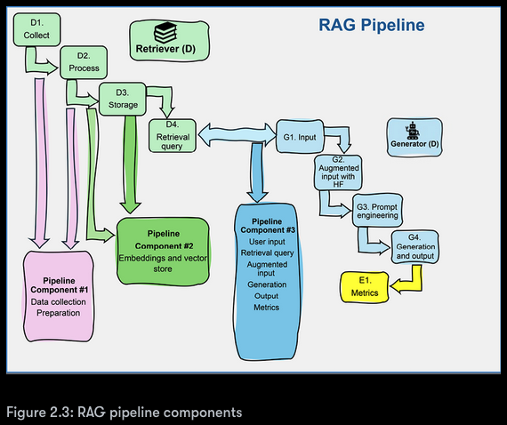

# Chapter 2: RAG Embedding Vector Stores with Deep Lake and OpenAI

## 🎯 Core Concepts

### **Embedding**
> A **numerical vector** representing the semantic meaning of text.

### **Vector Store**
> A **database optimized** to store and search embeddings.

### **Vector Database**
A **full-fledged system** designed to:
- Store high-dimensional vectors (embeddings)
- Perform fast similarity searches (e.g., nearest neighbor search)
- Handle scalability, indexing, filtering, metadata, persistence, etc.

**Examples:** `Pinecone`, `Weaviate`, `Qdrant`, `Milvus`, `Faiss` (with wrappers like LlamaIndex)

---

## 🔄 Architecture Relationship

> **Analogy:**
> - **Vector Store** = Interface or abstraction
> - **Vector Database** = Actual storage & search engine
> 
> User interacts with vector store → Vector store interacts with vector database

> **Note:** Many vector stores come with their own built-in vector databases, or at least their own way of storing and retrieving vectors.

---

## 🚀 RAG Pipeline

> **RAG (Retrieval-Augmented Generation):** A generative AI system that retrieves relevant documents and feeds them into a language model for output generation.

### **Key Components:**

#### **Chunking**
> The process of splitting large documents into manageable pieces for embedding.

#### **Augmented Output**
> The enhanced response generated by an LLM using additional contextual data.

---

## 📊 From Raw Data to Embeddings in Vector Stores

### **Optimizing Chunking**
> Intelligently splitting your data into the best-sized pieces before embedding, to improve performance in retrieval-augmented generation (RAG) and other AI tasks.

#### **Key Parameters:**

| Parameter | Description | Examples |
|-----------|-------------|----------|
| **Chunk Size** | Size of each text segment | `500`, `1000`, or `2,000` characters/tokens |
| **Overlap** | Overlap between chunks for context preservation | `50-200` tokens |
| **Chunk Boundaries** | Strategic breaking points | Not breaking mid-sentence or section |

#### **Optimization Goals:**
- ✅ **Maximize** semantic coherence in each chunk
- ✅ **Minimize** context loss across boundaries  
- ✅ **Improve** retrieval accuracy during semantic search

---

## 🔢 Understanding Embeddings

> **Embeddings** convert any data form (text, images, or audio) into **real numbers**. Documents are converted to **vectors**. These mathematical representations of documents allow us to calculate the **distances between documents** and retrieve similar data.

### **Process Flow:**
1. **Data Collection** → Fed into models for embeddings
2. **Chunking** → `Activeloop Deep Lake` breaks text into pre-defined chunks by character count
3. **Vectorization** → Mathematical representation for similarity calculations

---

## 🔍 RAG Transparency & Traceability

> **In RAG, every piece is traceable back to its source data**, ensuring the output's **transparency**. The **OpenAI generative model** will respond taking **augmented input** into account.

---

## 💾 Vector Store Implementation

> **Once we have our text and embeddings, the next step is to store them efficiently for quick retrieval.** This is where **vector stores** come into play.

### **Vector Store Characteristics:**
- **Specialized database** designed to handle high-dimensional data like embeddings
- **Serverless platforms** such as `Activeloop` (as shown in Figure 2.2)
- **API access** for creating and accessing datasets in code

> **💡 Note:** We'll implement this in the **Building a RAG Pipeline** section of this chapter.

---

## 🏗️ Organizing RAG in a Pipeline

### **❌ Don't Do This: Monolithic Approach**

> **Avoid writing one big script** that does everything in one monolithic program:

```
📋 Monolithic Script Tasks:
├── Collects data
├── Cleans it
├── Chunks and embeds it
├── Stores it in the vector store
├── Runs the RAG query
├── Sends it to the LLM
└── Displays the output
```

---

### **✅ Do This: Modular Component Architecture**

> **Break it into modular components (or services)** that can run independently:

#### **🔹 1. Data Ingestion & Indexing**
> **Run once or as needed**

**Handles:**
- Collecting documents
- Cleaning and chunking
- Creating embeddings
- Storing in vector store

> **💡 Think of this as a background job or pipeline, not something triggered every time a user asks a question.**

#### **🔹 2. Retrieval Component**
> **Runs on demand (real-time or per request)**

**Process:**
- Takes a user question, embeds it
- Performs similarity search in the vector store
- Returns relevant chunks with source info

#### **🔹 3. Generation Component**
> **Takes the user question + retrieved context**

**Process:**
- Formats it into a prompt
- Sends it to the OpenAI model (like GPT-4)
- Returns the final answer

---

## 🧠 Why Separate Components?

| **Benefit**           | **Explanation**                                                                 |
|-----------------------|---------------------------------------------------------------------------------|
| **Performance**       | Embedding and storing docs is slow — not suited for real-time interaction         |
| **Scalability**       | You can scale indexing, retrieval, and generation separately                     |
| **Reusability**       | You can reuse the same vector store across apps or sessions                      |
| **Reliability**       | Errors in one part (e.g., indexing) won't break the whole system                 |
| **Security & Isolation** | Sensitive data processing can be separated from public-facing components      |

---

## 🔄 RAG Pipeline Flow

```
📊 Data collection and preparation
    ↓
🔢 Data embedding and loading into the dataset of a vector store
    ↓
🔍 Querying the vectorized dataset to augment the input of a generative AI model to produce a response
```

---

## 🎯 Component Approach Benefits

### **1. Specialization**
> Each team member can focus on what they do best:
- Collecting and cleaning data
- Running embedding models
- Managing vector stores
- Tweaking generative AI models

### **2. Scalability**
> Easier to upgrade separate components as technology evolves:
- Scale different components with specialized methods
- Store raw data on different servers than cloud platforms
- Embed vectors in vectorized datasets separately

### **3. Parallel Development**
> Teams can advance at their own pace:
- No waiting for other teams
- Continuous improvements on one component
- No disruption to other processes

### **4. Maintenance Independence**
> Component-independent maintenance:
- Work on one component without affecting others
- Users can continue querying while fixes are made
- Example: Fix data collection while RAG pipeline runs in production

### **5. Security & Privacy**
> Minimized concerns through separation:
- Teams work separately with specific authorization
- Access and roles for each component
- Better control over sensitive data processing

---

## 🚀 Production Reality

> **In real-life production environments or large-scale projects, it is rare for a single program or team to manage end-to-end processes.** We are now ready to draw the blueprint of the RAG pipeline that we will build in Python in this chapter.

---

## 🚦 A RAG-Driven Generative AI Pipeline

Let’s dive into what a real-life RAG pipeline looks like. Imagine you’re part of a team tasked with delivering a complete system in just a few weeks. Right away, questions start flying:

- **Who’s going to gather and clean up all the data?**
- **Who’s setting up OpenAI’s embedding model?**
- **Who’s writing the code to generate embeddings and manage the vector store?**
- **Who’s implementing GPT-4 and handling its outputs?**

It can feel overwhelming—no one should tackle all of this alone!

> **Solution:** Split the work into specialized teams, each focusing on a different part of the pipeline. This modular approach makes the project manageable and efficient.

### **Figure 2.3: RAG Pipeline Components**



The project is divided into three main components, each handled by a dedicated group:

### 1️⃣ **Data Collection & Preparation (D1, D2)**
- **Team 1:** Collects and cleans the data, ensuring it’s ready for downstream processing.

### 2️⃣ **Data Embedding & Storage (D2, D3)**
- **Team 2:** Processes the cleaned data through OpenAI’s embedding model and stores the resulting vectors in an Activeloop Deep Lake dataset.

### 3️⃣ **Augmented Generation (D4, G1-G4, E1)**
- **Team 3:** Handles user input, retrieval queries, and content generation using GPT-4. This team focuses on prompt engineering, output generation, and evaluation.

> **Why this works:**
> - Each team can focus on their specialty without distractions.
> - Work progresses in parallel, reducing bottlenecks.
> - The project feels less daunting and more achievable.

The organization shown in Figure 2.3 is a practical variant of the RAG ecosystem’s framework (see also Figure 1.3 in Chapter 1).


Evaluating the output with cosine similarity

## 📊 Evaluating Output with Cosine Similarity

In this section, we explore how to measure the similarity between user input and the generative AI model's output using cosine similarity. This evaluation technique helps us understand how well our RAG pipeline is performing and whether the generated responses are semantically aligned with both the original user prompts and the augmented input.

### **Understanding Cosine Similarity**

Cosine similarity is a mathematical technique that measures the cosine of the angle between two vectors, providing a score between -1 and 1. In the context of text analysis, it helps us quantify how similar two pieces of text are to each other.

### **Two Approaches to Similarity Measurement**

#### **1. TF-IDF Based Similarity**
When using Term Frequency-Inverse Document Frequency (TF-IDF) vectorization, cosine similarity relies heavily on exact vocabulary overlap. This approach considers important language features such as semantic meanings, synonyms, and contextual usage. However, this method may produce lower similarity scores for texts that are conceptually similar but differ in word choice.

#### **2. Sentence Transformer Based Similarity**
Using Sentence Transformers involves embeddings that capture deeper semantic relationships between words and phrases. This approach is more effective in recognizing contextual and conceptual similarity between texts, even when they use different vocabulary.

### **Model Selection for Semantic Analysis**

For our implementation, we use the **all-MiniLM-L6-v2** model from the Hugging Face Model Hub. This model is part of the sentence-transformers library and offers:

- **Compact and efficient architecture** for quick processing
- **Strong performance** in generating meaningful sentence embeddings
- **Semantic understanding** that goes beyond simple word matching

### **Evaluation Results Comparison**

When comparing the two approaches:

- **TF-IDF Similarity Score:** Lower scores (around 0.396) even for acceptable human responses
- **Sentence Transformer Similarity Score:** Higher scores (around 0.739) that better capture semantic relationships

### **Key Insights**

The choice of evaluation metrics depends on the specific requirements of each project phase. While TF-IDF provides a baseline understanding of text similarity, Sentence Transformers offer more nuanced semantic analysis that better aligns with how humans understand text relationships.

### **Production Considerations**

When implementing these evaluation techniques in production environments, consider:

- **Separate Pipeline Component:** Evaluation could be its own modular component
- **Dependency Management:** Careful installation of additional libraries to avoid conflicts
- **Scalability:** Choose evaluation methods that can handle the expected volume of queries
- **Customization:** Adapt evaluation criteria based on specific use case requirements

This evaluation framework provides a foundation for measuring RAG pipeline performance. In Chapter 3, we'll explore advanced metrics when implementing index-based RAG with LlamaIndex, Deep Lake, and OpenAI.

