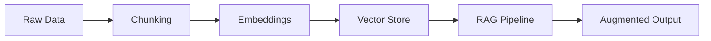

# Chapter 2: RAG Embedding Vector Stores with Deep Lake and OpenAI

## 🎯 Core Concepts

### **Embedding**
> A **numerical vector** representing the semantic meaning of text.

### **Vector Store**
> A **database optimized** to store and search embeddings.

### **Vector Database**
A **full-fledged system** designed to:
- Store high-dimensional vectors (embeddings)
- Perform fast similarity searches (e.g., nearest neighbor search)
- Handle scalability, indexing, filtering, metadata, persistence, etc.

**Examples:** `Pinecone`, `Weaviate`, `Qdrant`, `Milvus`, `Faiss` (with wrappers like LlamaIndex)

---

## 🔄 Architecture Relationship

> **Analogy:**
> - **Vector Store** = Interface or abstraction
> - **Vector Database** = Actual storage & search engine
> 
> User interacts with vector store → Vector store interacts with vector database

> **Note:** Many vector stores come with their own built-in vector databases, or at least their own way of storing and retrieving vectors.

---

## 🚀 RAG Pipeline

> **RAG (Retrieval-Augmented Generation):** A generative AI system that retrieves relevant documents and feeds them into a language model for output generation.

### **Key Components:**

#### **Chunking**
> The process of splitting large documents into manageable pieces for embedding.

#### **Augmented Output**
> The enhanced response generated by an LLM using additional contextual data.

---

## 📊 From Raw Data to Embeddings in Vector Stores

### **Optimizing Chunking**
> Intelligently splitting your data into the best-sized pieces before embedding, to improve performance in retrieval-augmented generation (RAG) and other AI tasks.

#### **Key Parameters:**

| Parameter | Description | Examples |
|-----------|-------------|----------|
| **Chunk Size** | Size of each text segment | `500`, `1000`, or `2,000` characters/tokens |
| **Overlap** | Overlap between chunks for context preservation | `50-200` tokens |
| **Chunk Boundaries** | Strategic breaking points | Not breaking mid-sentence or section |

#### **Optimization Goals:**
- ✅ **Maximize** semantic coherence in each chunk
- ✅ **Minimize** context loss across boundaries  
- ✅ **Improve** retrieval accuracy during semantic search

---

## 🎨 Visual Summary

---

## 📝 Key Takeaways

> **💡 Remember:** The goal is to create **semantically coherent chunks** that preserve context while enabling efficient retrieval and generation.

